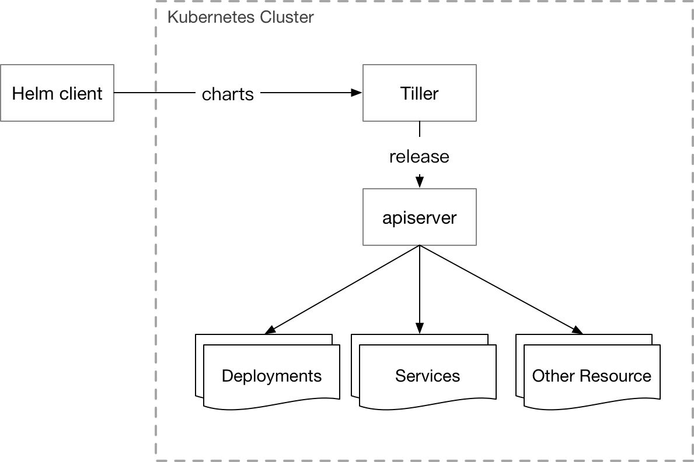
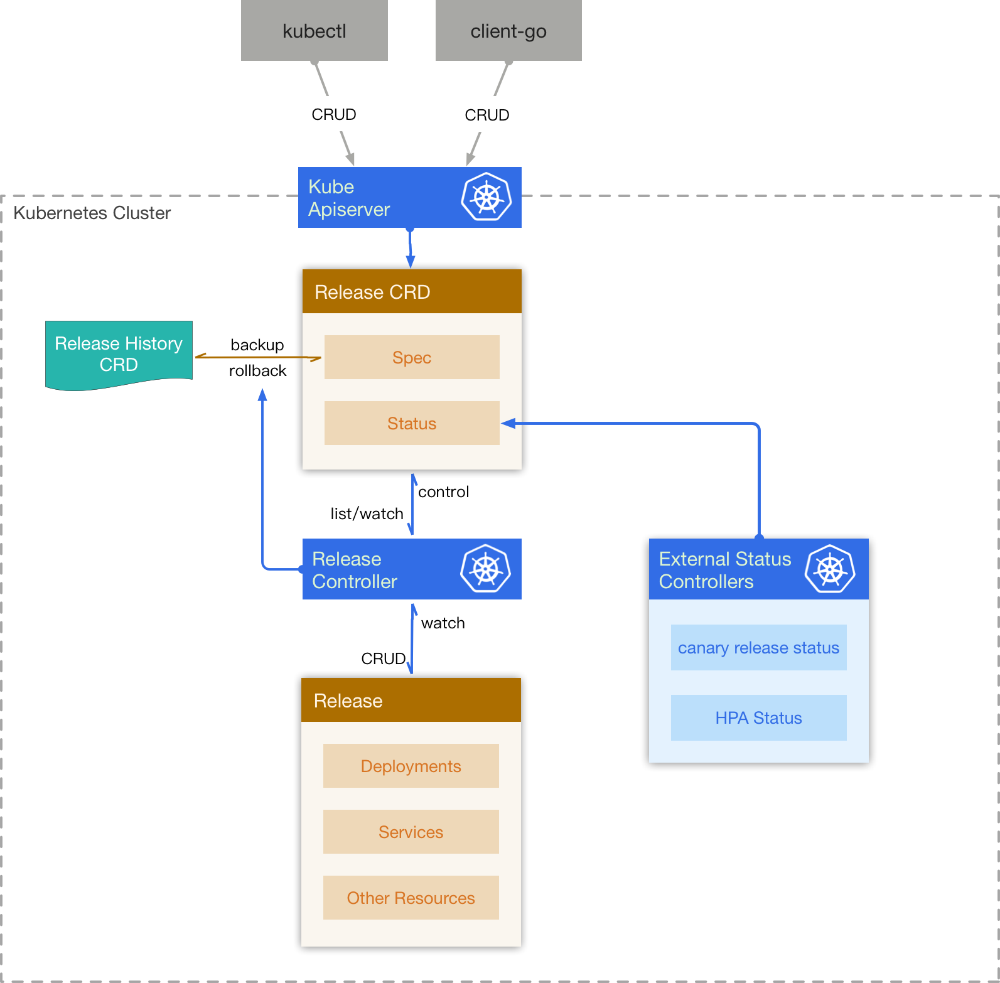

# Overview

The document describes an implementation of application packaging system based on helm. We briefly outlines what helm is, problems we have while working with helm, and goals for the rudder.

# Helm

## helm 2.0 architecture

Helm 2.0 architecture has two components: helm client and tiller server.
- The Helm Client is a command-line client for end users
- The Tiller Server is an in-cluster server that interacts with the Helm client, and interfaces with the Kubernetes API server

The end users use helm client to send charts to tiller server. The tiller server combines a chart and configuration to build a release and installs releases into kubernetes.



## Issues with helm 2.0

During the course of deploying and running helm in production, we've faced a couple of challenges. Following is a list of issues; it is by no means a comprehensive or the "right" list:

1. No built-in authorization in tiller. Tiller runs in `kube-system` namespace with high privileges.
2. Tiller installs releases into kubernetes but doesn't report component status (e.g. Pod, Deployment, etc).
3. Helm + Tiller does not follow kubernetes design pattern closely, which makes it less extensible - it is not easy to build extensions on top of Helm.
4. Not namespaced. Release has global scope in Helm, but most resources of a release are in namespace scope in Kubernetes. This sometimes can result in name confliction.
5. The rollback mechanism is incremental, i.e. a rollback operation will increase the version number. This mechanism is confusing to our users.

# Rudder

To solve the above issues, we designed `rudder` coupled with CustomResourceDefinition (CRD).

## Goal

1. The design should follow kubernetes controller pattern.
2. Release should be namespaced, and all related resources (except some special kinds, PV) are in a certain namespace. The applications can be isolated between multiple users.
3. Status tracking.

## Architecture



### Custom Resource Definition

#### Release

A `Release` contains a chart and configuration which are combined by rudder to render a manifest of Kubernetes resources. If a valid manifest is generated, rudder increases the version of release.

#### ReleaseHistory

A `ReleaseHistory` is a snapshot of a certain version of a release which is used for rollback.

## Components

### release controller

A release controller watches `Release CRDs` in kubernetes cluster.

When a new `Release CRD` is created, controller creates a new `ReleaseHistory` for the new `Release`, and parses the `chart` and `configuration` to combine them into a kubernetes resources manifest. It then creates all resources in the manifest to install the release into cluster. Finally, controller watches resources' status and embodies them in the status of `Release`.

When user updates the `Release`, controller figures out those resources need to be deleted, updated, or created, and does the corresponding operation on them. A new version of `RelaeseHistory` will be created if `Release` is updated successfully.

When user wants to rollback the `Release`, controller finds out the requested `ReleaseHistory`, and override the `Release` with the specific version `Release` in it.

When a releasee is deleted, controller will delete all resources and `ReleaseHistory` related to it.

### External Status Controller

There are some external component working around `Release CRD` and `resources` related to releases, e.g `CanaryRelease Controller` and `HPA controller`.

So there should be a external status controller to embody the external status in release.


### API Definition

### Release

```go
// Release describes a release wich chart and values
type Release struct {
	metav1.TypeMeta `json:",inline"`
	// +optional
	metav1.ObjectMeta `json:"metadata,omitempty"`
	// Specification of the desired behavior of the Release
	Spec ReleaseSpec `json:"spec,omitempty"`
	// Most recently observed status of the Release
	// +optional
	Status ReleaseStatus `json:"status,omitempty"`
}

// ReleaseSpec describes the basic info of a release
type ReleaseSpec struct {
	// Description is the description of current release
	Description string `json:"description,omitempty"`
	// Template is an archived template data, aka Chart
	Template []byte `json:"template,omitempty"`
	// Config is the config for parsing template
	Config string `json:"config,omitempty"`
	// The config this release is rolling back to. Will be cleared after rollback is done.
	RollbackTo *ReleaseRollbackConfig `json:"rollbackTo,omitempty"`
}

// ReleaseRollbackConfig describes the rollback config of a release
type ReleaseRollbackConfig struct {
	// The version to rollback to. If set to 0, rollbck to the last version.
	Version int32 `json:"version,omitempty"`
}


```

### ReleaseHistory

```go
// ReleaseHistory describes a history of a release version
type ReleaseHistory struct {
	metav1.TypeMeta `json:",inline"`
	// +optional
	metav1.ObjectMeta `json:"metadata,omitempty"`

	// Specification of the desired behavior of the ReleaseHistory
	// +optional
	Spec ReleaseHistorySpec `json:"spec,omitempty"`
}

// ReleaseHistorySpec describes the history info of a release
type ReleaseHistorySpec struct {
	// Description is the description of current history
	Description string `json:"description,omitempty"`
	// Version is the version of a history
	Version int32 `json:"version,omitempty"`
	// Template is an archived template data, aka Chart
	Template []byte `json:"template,omitempty"`
	// Config is the config for parsing template
	Config string `json:"config,omitempty"`
	// Manifest is the generated kubernetes resources from template
	Manifest string `json:"manifest,omitempty"`
}
```
